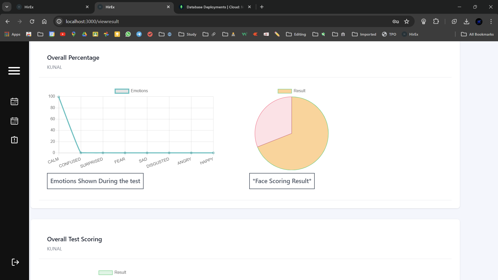
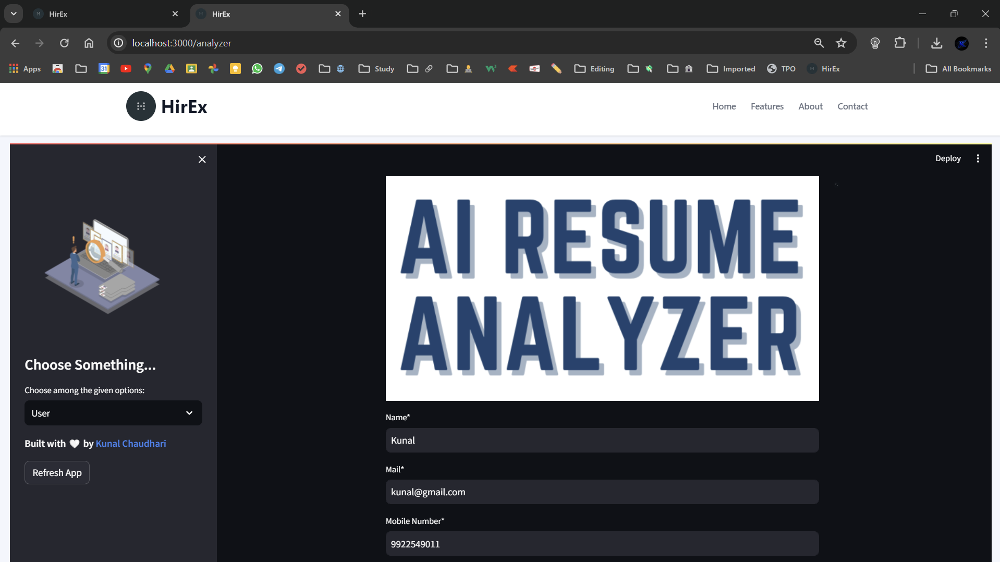
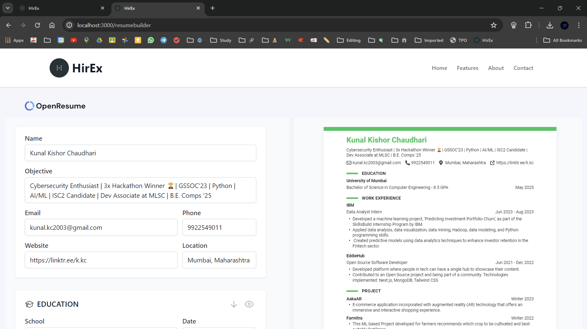

# HirEx

## Overview
HirEx is an advanced recruitment system built with React and Node.js. It incorporates artificial intelligence and computer vision technologies to revolutionize the hiring process. The system provides automated assessment techniques, including speech-to-text conversion, facial emotion recognition, and tone analysis, for objective evaluations of candidates. It also features a resume builder and a chatbot for interactive placement training support.

## Already Deployed
The HirEx system has already been deployed and is accessible via the following link: [SmartHire](xyz). You can visit the deployed site to explore the features and functionalities of the system without having to set it up locally.

## Folder Structure
The project's folder structure is organized as follows:

- `HirEx`: The root folder of the project.
  - `client`: Contains the React frontend code.
  - `backend`: Contains the Node.js backend code.

## Getting Started
To get started with Smart Hire, please follow the steps below:

### Prerequisites
- Node.js installed on your machine
- AWS Rekognition API credentials
- Cloudinary API credentials
- OpenAI API credentials

### Installation
1. Clone the repository: `git clone https://github.com/youreachedrahat/HirEx.git`
2. Navigate to the project directory: `cd HirEx`
3. Install the dependencies: `npm install`
4. Install the dependencies for the server: `cd backend && npm install`
5. Install the dependencies for the client: `cd ../client && yarn install`

### Configuration
1. Rename the `.env.example` file in the `backend` directory to `.env`.
2. Open the `.env` file and update the following variables with your credentials:
   - `accessKeyId`, `region` and `secretAccessKey`: AWS Rekognition API credentials
   - `cloudName`, `apiKey`, `apiSecret` and `uploadPreset`: Cloudinary API credentials
   - `OPENAI_API_KEY`: OpenAI API key

### Resume Analyzer Repo
1. Refer this repo for more understanding and working of Resume Analyzer: [https://github.com/kc-codes/Resume_Analyzer](https://github.com/kc-codes/Resume_Analyzer)

### HirEx Bot Repo
1. Refer this repo for more understanding and working of Resume Analyzer: [https://github.com/kc-codes/HirEx_BOT](https://github.com/kc-codes/HirEx_BOT)

### Usage
1. Start the application using the following command: `npm run dev`
2. Access the Smart Hire system through your web browser: `http://localhost:3000`
3. Follow the on-screen instructions to perform various tasks, such as conducting interviews, analyzing candidate responses, and utilizing the chatbot.

### Screenshot

**SmartHire Architecture**

**HireEx Process Design**

**Home**

**Feature**

**InterviewGenerator**

**OrganizationProfile**

**OrganizationInterviewCreation**

**CandidateProfile**

**CandidateInterviewSection**

**Actual Interview**

**EmotionDetection of the given interview**

**ResultInterview**

**ResultInterview1**

**Resume Analyzer**

**Resume Analyzer2**

**Resume Analyzer3**

**ResumeAnalyzer_Admin1**

**ResumeAnalyzer_Admin2**

**ResumeBuilder1**

**ResumeBuilder2**

**HirEx Chatbot**

<!-- **abc**

 -->

